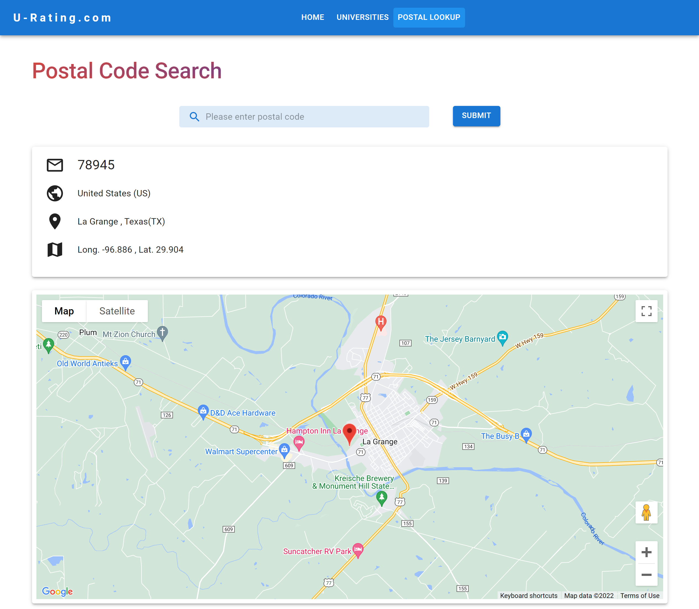

# Tom_launchpad-react-code-challenge

A react-redux app for Launchpad by Vog Code Challenge

## Table of contents

- [Tom_launchpad-react-code-challenge](#tom_launchpad-react-code-challenge)
  - [Table of contents](#table-of-contents)
  - [Overview](#overview)
    - [Requirements](#requirements)
    - [Screenshot](#screenshot)
    - [Links](#links)
  - [My process](#my-process)
    - [Built with](#built-with)
    - [Continued development](#continued-development)
  - [Author](#author)
  - [Acknowledgments](#acknowledgments)

## Overview

### Requirements

The entire application is divided into three pages : Home, Universites and Postal Lookup

- The App needs to display a navigation bar which links to the "Universities" page and the " Postal lookup" page.
- On the home page you need to use provided APIs to perform CRUD operations.
  - All posts must be displayed on the home page with options to add, edit and delete.
  - An add post button is required to pop up a modal on click to enable adding a new post.
  - An edit post and a delete post button are needed to edit or delete existing post.
  - A search bar is required to search a specific post by Id.
- On universities page, data coming from API should be displayed.
  - Universities data should be requested by the country name.
  - Country is selected from a dropdown menu and the country list should be fetched from an API
- On postal lookup page, perform search on area details using US zip code.

### Screenshot

### Links

- Live Site: [U-Rating.com]()

## My process

### Built with

- [Material UI](https://mui.com/) - Component library
- [Redux](https://redux.js.org/) - State Management
- [React Router](https://reactrouter.com/) - Routing library
- [React](https://reactjs.org/) - JS library
- [Create React App](https://create-react-app.dev/) - CRA for React build setup
- [@react-google-maps/api](https://www.npmjs.com/package/@react-google-maps/api) - A library for integrating Google map API into React component

### Continued development

- Add typechecking with TypeScript
- Optimize performance of React components and Redux
- Add testings

## Author

- GitHub - [Haoliang Zhang](https://github.com/HaoLZz)
- LinkedIn - [Haoliang Zhang](https://www.linkedin.com/in/haoliangzhangengineer/)

## Acknowledgments

Thank Christie L. Rodrigues from [LaunchPad by Vog](https://launchpadbyvog.com/) for providing this code challenge.
